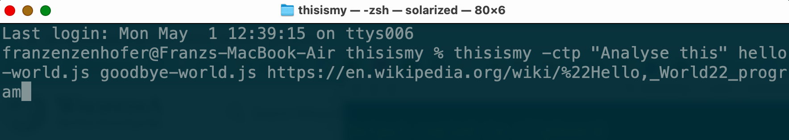
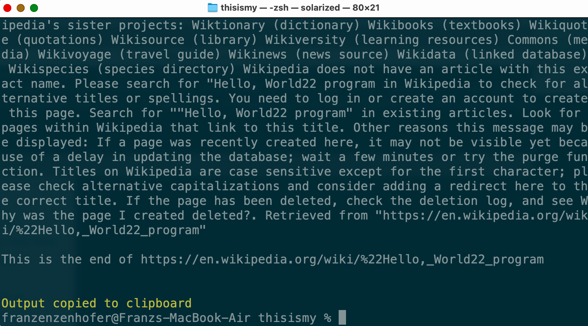

# thisismy

Coded by ChatGPT V4.

Directed by Franz Enzenhofer.

## What does it do?

`thisismy` concatinats files, removes unnecessary whitespace,  prefixes it with "This is my current %filename%:" and pushes it to the clipboard (or elsewhere). Also works with online resources. Intended use is ChatGPT prompts with lots of code and docs. 

## What does it solve?

**Coding with ChatGPT** quite fast ends up with **copy&paste-ing again and again** multiple files as prompts prefixed with "This is my current %file%" into the ChatGPT textbox. Same with online ressources. This a) make one **crazy over time** and b) **wastes lots of time** and c) **wastes tokens** as unnecessary stuff (mostly whitespaces and boilerplate from the webpages) ends up in there. `thisismy` solves this. 


## Tell me more

`thisismy` is a command-line utility designed to simplify the process of creating prompts for ChatGPT. With `thisismy`, you can print the contents of one or more files or online resources to the terminal, copy them to the clipboard and whitespace reduce them to save tokens. I.e.:

`thisismy -c -t -p "ChatGPT check this code for the best practices outlined in the online ressource." file1.js file2.js http://example.com/index.html
` 

This command will copy (`-c`) the contents of `file1.js` and `file2.js` and the **main content** of `http://example.com/index.html` to the **clipboard**, with **double whitespaces removed** (`-t`). Each time the output is prefixed with "`This is my current %file%`" and "`This is the current %url%`". The whole response is **prefixed** (`-p`) with the defined prefix string. 






## Installation 
To install the `thisismy` package from GitHub and link it globally, you can follow these steps: 

1. Clone the `thisismy` repository from GitHub: 
``` 
git clone https://github.com/franzenzenhofer/thisismy.git 
``` 

2. Navigate to the `thisismy` directory: 
``` 
cd thisismy 
``` 

3. Install the dependencies: 
``` 
npm install 
``` 

4. Link the package globally: 
``` 
npm link 
``` 

Now you should be able to use the `thisismy` command anywhere in your terminal. 

## Usage 
To use `thisismy`, you can run the command followed by the file path(s) you want to print: 

``` 
thisismy path/to/file.txt 
``` 

You can also specify multiple file paths: 

``` 
thisismy path/to/file1.txt path/to/file2.txt 
``` 

If you want to use an online resource, you can pass the URL instead of the file path: 

``` 
thisismy https://www.example.com/index.html 
``` 

### Options 
`thisismy` supports several options: 

| Option          | Alias | Description                                                     |
|----------------|-------|-----------------------------------------------------------------|
| `--copy`       | `-c`  | Copies the output to the clipboard                              |
| `--tiny`       | `-t`  | Removes double whitespaces from the read files                  |
| `--file`       |       | List of files or URLs to read                                    |
| `--prefix`     | `-p`  | Prefix for the output. Can be a string or a file                 |
| `--output`     | `-o`  | Writes output to a file                                          |
| `--help`       | `-h`  | Prints usage information                                         |
| `--silent`     | `-s`  | Silent output                                                   |
| `--debug`      | `-d`  | Debug mode                                                      |
| `--version`    | `-v`  | Prints the version number and exits                              |
| `--license`    | `-l`  | Prints the license and exits                                     |
| `--noColor`    | `-n`  | Disable colorized output                                         |


#### Example Usage 
Print the contents of a file to the terminal: 

``` 
thisismy path/to/file.txt 
``` 

Copy the contents of a file to the clipboard: 

``` 
thisismy -c path/to/file.txt 
``` 

Write the contents of a file to a new file: 

``` 
thisismy -o path/to/newfile.txt path/to/file.txt 
``` 

Specify a prefix for the output: 

``` 
thisismy -p "Prefix for output" path/to/file.txt 
``` 

If you want to use a file as a prefix, you can pass the file path as an argument to the `-p` option. For example: 

``` 
thisismy -p /path/to/prefix.txt path/to/file.txt 
``` 

This will use the contents of `/path/to/prefix.txt` as the prefix for the output. 


## Example for -t option

Suppose you have a file called `example.txt` with double spaces between some words. You can use the `-t` option to remove them and print the contents of the file:

```
thisismy -t example.txt
```

## Example for using -c -t -p while multiple files, a prefix and an online resource

Suppose you have two files, `file1.txt` and `file2.txt`, an online resource `http://example.com/index.html`, and you want to prefix the output with the contents of a file called `prefix.txt`. You also want to remove double whitespaces from the read files and copy the output to the clipboard. You can use the following command:

```
thisismy -c -t -p prefix.txt file1.txt file2.txt http://example.com/index.html
```

This will print the contents of `file1.txt`, `file2.txt`, and the online resource with double whitespaces removed and a prefix of the contents of `prefix.txt`. The output will also be copied to the clipboard.


Sure, here's an example README.md for the `-b` backup feature you described:

# Thisismy Backup Feature

This is a new feature added to Thisismy that allows you to backup your current arguments to a JSON file and use those values as defaults whenever you run Thisismy in the same directory.

## How to Use

To use this feature, simply add the `-b` or `--backup` option when running Thisismy. For example:

```
$ thisismy -bct file.txt
```

This will create a `thisismy.json` file in the current directory with the current arguments used for the prompt. The contents of the file will look like this:

```json
{
  "copy": true,
  "tiny": true,
  "file": ["file.txt"],
  "prefix": "",
  "output": "",
  "help": false,
  "silent": false,
  "debug": false,
  "version": false,
  "license": false,
  "noColor": false
}
```

Whenever you run Thisismy in the same directory, it will look for a `thisismy.json` file and use the values there as the defaults. You can still override these defaults by passing in new arguments when running Thisismy.

## Notes

- If you run Thisismy in a different directory, it will not use the `thisismy.json` file in the current directory. Instead, it will use the default values for all the arguments.
- If you want to update the defaults in the `thisismy.json` file, simply run Thisismy with the new arguments and the file will be updated with the new values.


## License

`thisismy` is licensed under the MIT License. See [LICENSE](LICENSE) for more information.


